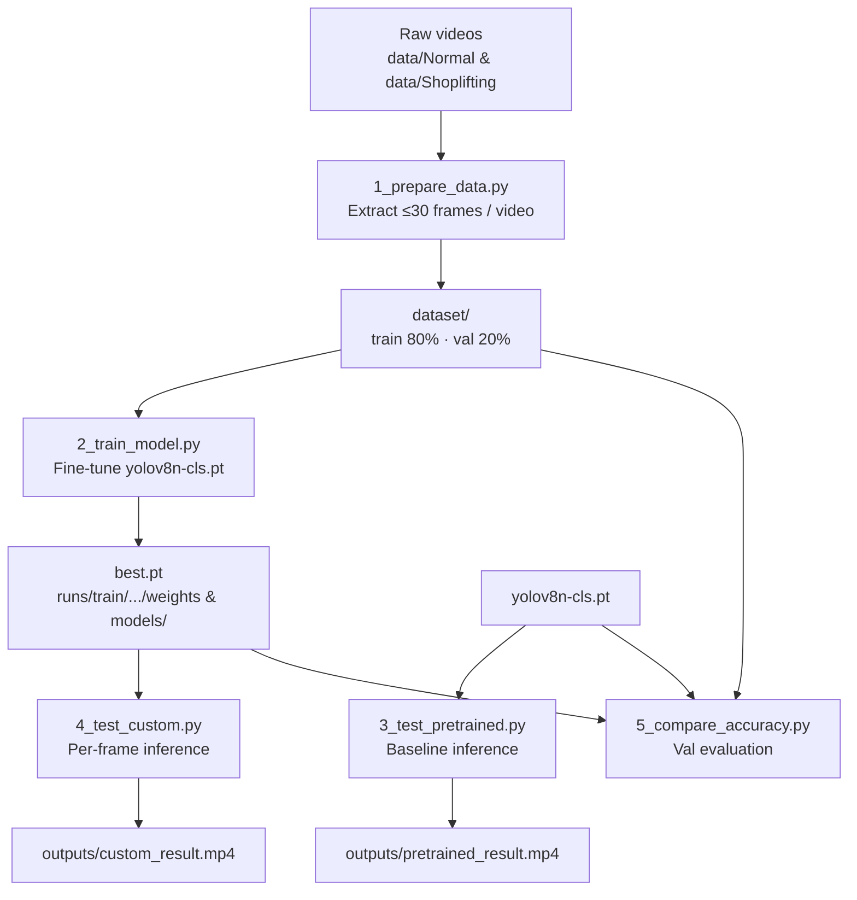

# EagleEye

> Video-based shoplifting classification using a fine-tuned YOLOv8 nano classification model (`yolov8n-cls`).

## 📌 Overview

Retail shrinkage from theft is hard to spot at scale when review depends on manual CCTV monitoring. EagleEye addresses this by classifying video frames as **Normal** or **Shoplifting** with a custom YOLOv8 image classifier.

The pipeline extracts frames from labeled videos, fine-tunes Ultralytics YOLOv8 classification weights, runs per-frame inference on new videos, and compares a pretrained baseline against the custom model on a validation set.

This project is useful for students, interviewers, and developers exploring applied computer vision for surveillance-style binary classification—from data preparation through training, inference, and evaluation scripts.

## ✨ Features

- Frame extraction from `.mp4` / `.avi` videos with an 80/20 train–validation split by video
- Fine-tuning of pretrained `yolov8n-cls.pt` on a two-class image dataset (`Normal`, `Shoplifting`)
- Inference on videos using the pretrained classification weights (baseline / demo)
- Inference on videos using a custom trained model (`best.pt`), with on-frame labels and confidence
- Validation-set comparison of pretrained vs custom models (accuracy, classification report, confusion matrix)
- Optional Graphviz scripts to generate system and YOLOv8 conceptual architecture diagrams

## 🧠 How It Works

1. **Input** — Place class-labeled videos under `data/Normal/` and `data/Shoplifting/`.
2. **Preprocessing** (`1_prepare_data.py`) — Sample up to 30 frames per video, save JPEGs under `dataset/train|val/{class}/{video_name}/`.
3. **Training** (`2_train_model.py`) — Load `yolov8n-cls.pt`, train on `dataset/`, save best weights under `runs/train/shoplifting_model/` and copy to `models/best.pt`.
4. **Inference**
   - Pretrained baseline: `3_test_pretrained.py` runs `yolov8n-cls.pt` frame-by-frame and writes an annotated video.
   - Custom model: `4_test_custom.py` runs `best.pt`, overlays class + confidence, and prints frame-level summary stats.
5. **Evaluation** (`5_compare_accuracy.py`) — Scores both models on `dataset/val` frames and prints accuracy, sklearn classification report, and confusion matrix.

```text
Video → Frames → YOLOv8-cls → Class probabilities → Annotated video / metrics
```

## 🏗️ System Architecture



Major components:

| Component | Role |
| --------- | ---- |
| `1_prepare_data.py` | Builds the image classification dataset from videos |
| `2_train_model.py` | Fine-tunes YOLOv8 classification |
| `3_test_pretrained.py` | Video inference with stock `yolov8n-cls.pt` |
| `4_test_custom.py` | Video inference with custom `best.pt` |
| `5_compare_accuracy.py` | Side-by-side validation metrics |
| Diagram generators | Optional PNG/SVG architecture visuals via Graphviz |

## 🛠️ Tech Stack

| Technology | Purpose |
| ---------- | ------- |
| Python | Core language for all scripts |
| [Ultralytics YOLOv8](https://github.com/ultralytics/ultralytics) | Classification training and inference (`YOLO`, `yolov8n-cls.pt`) |
| OpenCV (`cv2`) | Video I/O, frame extraction, annotation, output writing |
| NumPy | Confidence aggregation and accuracy helpers |
| scikit-learn | Classification report and confusion matrix |
| Graphviz + `graphviz` (Python) | Optional architecture diagram generation |

## 📂 Project Structure

```text
EagleEye/
├── 1_prepare_data.py                 # Video → frame dataset preparation
├── 2_train_model.py                  # Fine-tune YOLOv8-cls on dataset/
├── 3_test_pretrained.py              # Inference with yolov8n-cls.pt
├── 4_test_custom.py                  # Inference with best.pt
├── 5_compare_accuracy.py             # Pretrained vs custom on dataset/val
├── generate_architecture_diagram.py  # System pipeline diagrams (Graphviz)
├── generate_yolov8_internal_diagram.py
├── best.pt                           # Custom trained classification weights
├── yolov8n-cls.pt                    # Pretrained YOLOv8 nano classifier
├── yolov8n.pt                        # YOLOv8 nano detection weights (present; unused by scripts)
├── Redmon_You_Only_Look_CVPR_2016_paper.pdf
├── temp.txt
├── requirements.txt               # Python dependencies
└── README.md
```

Created at runtime (not committed by default):

```text
data/Normal/ … data/Shoplifting/   # Input videos (required for prepare/train/test)
dataset/train|val/{class}/…        # Extracted frames
models/best.pt                     # Copy of best weights after training
runs/train/shoplifting_model/      # Ultralytics training outputs & plots
outputs/                           # Annotated result videos
architecture/                      # Generated diagrams (if Graphviz scripts are run)
```

## ⚙️ Installation

### Prerequisites

- Python 3 (compatible with the Ultralytics package you install)
- Pip package manager
- OpenCV-capable environment (for reading/writing video)
- **Optional:** CUDA GPU for faster training (scripts also run on CPU)
- **Optional:** [Graphviz](https://graphviz.org/) system install + Python `graphviz` for diagram scripts

### Clone Repository

```bash
git clone https://github.com/satishchauhan108/YOLOv8-Object-Detection.git
cd YOLOv8-Object-Detection
```

### Create Environment

```bash
python -m venv venv

# Windows
venv\Scripts\activate

# macOS / Linux
source venv/bin/activate
```

### Install Dependencies

`requirements.txt` contains the project's Python dependencies and should be installed inside the activated virtual environment.

```bash
pip install -r requirements.txt
```

Also install the Graphviz system binary and ensure `dot` is on your `PATH` if you use the diagram scripts.

## 🚀 Usage

Prepare your videos first:

```text
data/
├── Normal/
│   └── *.mp4 | *.avi
└── Shoplifting/
    └── *.mp4 | *.avi
```

### Training

```bash
python 1_prepare_data.py
python 2_train_model.py
```

Training writes to `runs/train/shoplifting_model/` and copies the best checkpoint to `models/best.pt`.  
Inference script `4_test_custom.py` loads `best.pt` from the **project root** by default (a root-level `best.pt` is already included in this repository).

### Inference

**Pretrained baseline** (expects `data/Shoplifting/video1.mp4` by default; edit the path in the script if needed):

```bash
python 3_test_pretrained.py
```

Output: `outputs/pretrained_result.mp4`

**Custom model** (default model path: `best.pt`; default test video: `data/Shoplifting/video1.mp4`):

```bash
python 4_test_custom.py
```

Output: `outputs/custom_result.mp4`, plus console counts for Normal / Shoplifting frames and average confidence.

### Evaluation

Requires `best.pt` and a prepared `dataset/val/`:

```bash
python 5_compare_accuracy.py
```

### Architecture Diagrams (optional)

```bash
python generate_architecture_diagram.py
python generate_yolov8_internal_diagram.py
```

Outputs are written under `architecture/`.

## 📊 Model / Training Details

| Item | Value (from code) |
| ---- | ----------------- |
| Task | Image classification (not object detection) |
| Base model | `yolov8n-cls.pt` (YOLOv8 nano classifier) |
| Classes | `Normal`, `Shoplifting` |
| Dataset layout | Ultralytics classification folder layout under `dataset/` |
| Input (training) | JPEG frames from videos; `imgsz=224` |
| Frames per video | Up to 30, sampled across the clip |
| Train / val split | 80% / 20% of videos per class (by list order) |
| Epochs | `10` |
| Batch size | `16` |
| Image size | `224` |
| Early stopping patience | `10` |
| Save location | `runs/train/shoplifting_model/`, copied to `models/best.pt` |
| Plots | Enabled (`plots=True`) |

Optimizer, loss function, and other Ultralytics defaults are not overridden in `2_train_model.py`; they follow the Ultralytics training defaults for classification.

Inference (`4_test_custom.py`) uses `results[0].probs` (top-1 class and confidence) and annotates each frame before writing the output video.

## 📈 Results

No saved evaluation metrics (accuracy tables, confusion matrices, or training curves) are checked into this repository.

Run `2_train_model.py` for Ultralytics plots under `runs/train/shoplifting_model/`, and `5_compare_accuracy.py` to print accuracy, classification report, and confusion matrix for your local validation set.

## 🔍 Example

After placing videos and preparing data:

```bash
python 1_prepare_data.py
python 2_train_model.py
# Ensure best.pt is available in the project root (copy from models/best.pt if needed)
python 4_test_custom.py
```

Example console summary from custom inference (shape of output; numbers depend on your video):

```text
==================================================
Results:
==================================================
Total frames: …
Normal: … (…%)
Shoplifting: … (…%)
Average confidence: …
Output saved to: outputs/custom_result.mp4
```

## ⚠️ Limitations

- **Frame-level classification only** — no object detection boxes, tracking, or temporal models (LSTM/Transformer over sequences).
- **Binary labels** — only `Normal` vs `Shoplifting`; no multi-behavior taxonomy.
- **Data not included** — `data/` and `dataset/` must be supplied locally; results depend entirely on your videos and labeling quality.
- **Split is not shuffled** — the 80/20 split uses video list order (`os.listdir`), which can bias train/val composition.
- **Pretrained baseline is not shoplifting-aware** — `3_test_pretrained.py` notes that stock `yolov8n-cls.pt` was not trained on this task.
- **Hard-coded test paths** — default test video is `data/Shoplifting/video1.mp4`; change the script for other files.
- **Weight path mismatch** — training copies best weights to `models/best.pt`, while custom inference defaults to root `best.pt`.
- **Evaluation class-index assumption** — `5_compare_accuracy.py` maps prediction index `1` to `Shoplifting` and otherwise to `Normal`.
- **No web UI or API** — CLI scripts only.
- **`yolov8n.pt` unused** — detection weights are present but not referenced by the provided pipeline scripts.

## 🔮 Future Improvements

- Shuffle or stratified video-level splits; hold out a true test set
- Align training export path with inference (`models/best.pt` vs root `best.pt`)
- CLI arguments for video paths, model paths, epochs, and batch size
- Temporal aggregation (e.g., majority vote or sequence models) instead of independent frames
- Broader datasets, class balancing, and richer augmentations
- Optional detection/tracking pipeline if localization of people/objects is required
- Persist evaluation metrics and plots into a documented `results/` folder
- Lightweight demo UI for uploading a clip and viewing predictions

## 🤝 Contributing

Contributions that improve data handling, training configuration, evaluation reporting, or documentation are welcome.

1. Fork the repository
2. Create a feature branch
3. Commit clear, focused changes
4. Open a pull request describing the motivation and how to test it

## 👨‍💻 Author

**Satish Chauhan**  
GitHub: [satishchauhan108](https://github.com/satishchauhan108)

## 📚 Additional Notes

- The GitHub remote is named `YOLOv8-Object-Detection`, but the implemented task is **classification** via `yolov8n-cls`, not bounding-box detection.
- A copy of the original YOLO CVPR 2016 paper (`Redmon_You_Only_Look_CVPR_2016_paper.pdf`) is included for reference; the runtime stack is Ultralytics YOLOv8.
- Training time varies (the training script notes roughly 10–30 minutes depending on GPU/CPU).
- If Graphviz is missing, the diagram scripts print PATH/install guidance and exit without generating images.
